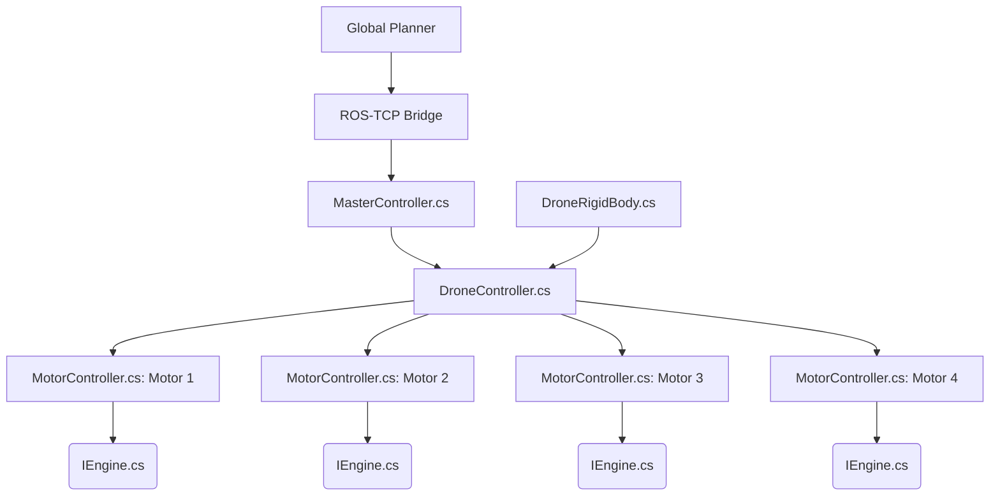

**Drone Physics**

**Table of Contents**
<!-- TOC -->

- [Thought Process](#thought-process)
- [Code Explanation](#code-explanation)
    - [DroneRigidBody.cs](#dronerigidbodycs)
    - [MasterController.cs](#mastercontrollercs)
    - [DroneController.cs](#dronecontrollercs)
    - [MotorController.cs](#motorcontrollercs)
    - [IEngine.cs](#ienginecs)

<!-- /TOC -->

# Thought Process
Below is our current model of how the code is stacked up into layers. The Global Planner is build on the ROS end to support the coding with C++/Python. 

The Global Planner provides coordinates of where the drone should go to, the coordinates are transferred via ROS-TCP bridge to the [MasterController.cs](#mastercontrollercs) script which send the coordinates to individual [DroneController.cs](#dronecontrollercs) which contains Robust Controller Implemented in it.

[DroneController.cs] contains the implementation of Robust Controller Implementation which takes coordinates for a particular drone from [MasterController.cs](#mastercontrollercs) and has 4 objects of [MotorController.cs](#motorcontrollercs) which takes motor rotational speed as intake.

[MotorController.cs](#motorcontrollercs) is created based on the implementation file of [IEngine.cs](#ienginecs) which is made to set the propeller speed and generate force under the rotors to simulate close to actual physics as much as possible.

**A general representation looks similar to as shown:**

# Code Explanation

## DroneRigidBody.cs
## MasterController.cs
## DroneController.cs
## MotorController.cs
## IEngine.cs