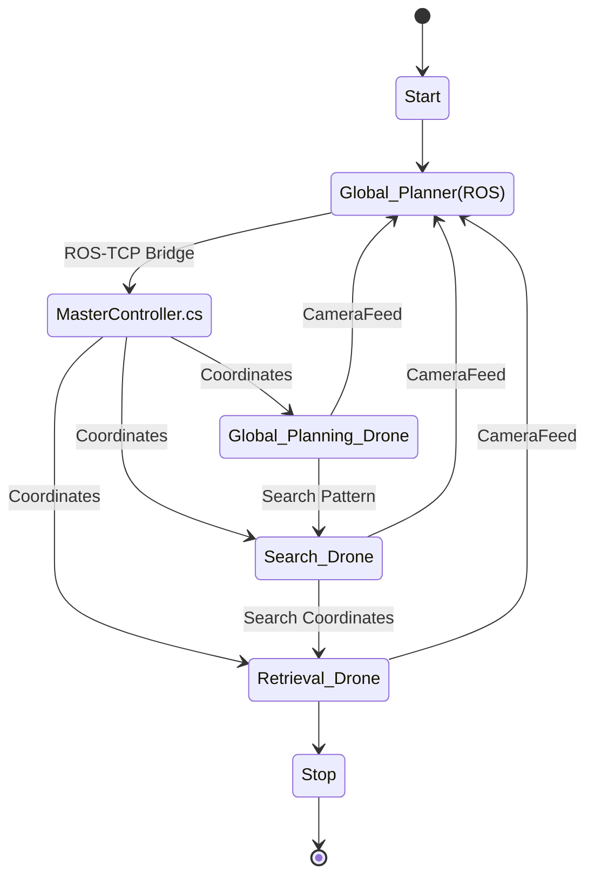

<!-- TOC -->

- [Introduction](#introduction)
- [How to setup the project](#how-to-setup-the-project)
    - [Install Essential Softwares[^1]](#install-essential-softwares%5E1)
- [Code Explanation](#code-explanation)
    - [Drone Dynamics and Controls](#drone-dynamics-and-controls)
- [Designer Details](#designer-details)
- [License](#license)

<!-- /TOC -->

# Introduction

# How to setup the project

## Install Essential Softwares[^1]

- Install [ROS 1 Noetic](./Docs/Setup%20Guides/Install%20ROS%20Noetic.md).
- Setup [Unity](./Docs/Setup%20Guides/Setup%20Unity.md) and [install all the essential packages](./Docs/Setup%20Guides/Install%20Essential%20Unity%20Packages.md).
- Install [Visual Studio Code](./Docs/VSCode.md) for developing the Motion Planning Algorithms.
- Install [Visual Studio](https://learn.microsoft.com/en-us/visualstudio/gamedev/unity/get-started/getting-started-with-visual-studio-tools-for-unity?pivots=windows)[^2] for developing the Unity Code.

[^1]: All the Softwares are installed for Ubuntu 20.04 LTS. Though most of the softwares are cross platform, we haven't built or tested them for it. You can port it to the system of your liking but maybe try to debug the issues with loads of help from [google](www.google.com).

[^2]:*Visual Studio is developed only for Windows and Mac and works best in terms for AutoCompletion and Intellisense for Unity*

<!-- - Setup [Crazyflie 2.0 in Gazebo](./Docs/Setup%20Guides/Gazebo-Crazyflie.md). -->

# Code Explanation

This is a general idea of how the code flows. We have 3 tiers of drones which fly one after another to perform the operations in sequence and need.

## Drone Dynamics and Controls

A great benefit of using Unity is the inherent support to simulate Dynamics and Physics on your GameObject. So we have took advantage of it and developed our drone to mimic real life Physics behavior and Rigid Body Dynamics as close as possible. 

Trajectory Tracking is needed for the drones to follow the path planned by the Motion Planner. We could have developed drones which just track the paths without any realistic deviation but, that would not had been fun. We developed a robust controller as an actual drone would have so our drone will mimic an actual drone closely with some minor assumption. 

Detailed development is explained [here](./Docs/Code%20Explaination/Drone%20Simulation.md).

<!-- 🥳 _Ladies and Gentlemen!!_ \
🥳 _Hope you have a good day!!_\
🥳 _We are all done with the project here!!_ -->

# Designer Details

- Designed for:
  - Worcester Polytechnic Institute
  - RBE550-S23-S01: Motion Planning (Online) - Final Project
- Designed by:
  - [Parth Patel](mailto:parth.pmech@gmail.com)

# License

This project is licensed under [GNU General Public License v3.0](https://www.gnu.org/licenses/gpl-3.0.en.html) (see [LICENSE.md](LICENSE.md)).

Copyright 2023 Parth Patel

Licensed under the GNU General Public License, Version 3.0 (the "License"); you may not use this file except in compliance with the License.

You may obtain a copy of the License at

_https://www.gnu.org/licenses/gpl-3.0.en.html_

Unless required by applicable law or agreed to in writing, software distributed under the License is distributed on an "AS IS" BASIS, WITHOUT WARRANTIES OR CONDITIONS OF ANY KIND, either express or implied. See the License for the specific language governing permissions and limitations under the License.